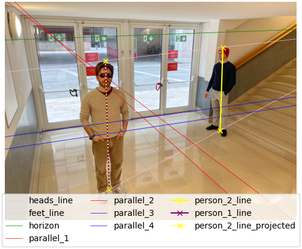

# Single View Metrology & Eight-Point Algorithm
## Computer Vision and Image Processing

This repository contains the implementation of two fundamental computer vision techniques:
1. **Single View Metrology** for height estimation from a single image
2. The **Eight-Point Algorithm** for fundamental matrix estimation from two views

This work was developed as part of the *Computer Vision and Image Processing* course (20878) at *Bocconi University*'s *MSc in Artificial Intelligence* program by:
- [Alessandro Bellini](https://github.com/alefrabel)
- [Davide Beltrame](https://github.com/davide-beltrame)
- [Giacomo Cirò](https://www.github.com/giacomo-ciro)

## Single View Metrology

We implemented a method to estimate a person's height from a single image using projective geometry. Our approach leverages the mathematical properties of parallel lines in a scene to compute vanishing points and the horizon line.

### Methodology

1. Annotate an image with:
   - Two pairs of parallel lines
   - A reference height (known)
   - The height to be estimated (unknown)

2. Use the cross-product property to:
   - Identify lines from the annotated points
   - Find vanishing points and the horizon line
   - Project heights onto a common reference

3. Calculate the unknown height using proportional relationships

### Results

Our implementation achieved high precision on test images, estimating a 184 cm person's height as 184.10 cm using a 175 cm reference.

 *The final result. The purple line (Person 1’s height) is known to be 175 cm in reality. The yellow line (Person 2’s height) is estimated to be 184.10 cm (which in reality is 184 cm). The dashed yellow line represents the projection of the yellow line onto the purple line.*

## Eight-Point Algorithm

We implemented the eight-point algorithm to estimate the fundamental matrix from point correspondences between two views of the same scene, allowing us to compute epipolar geometry.

### Methodology

1. Manual annotation of 30 point correspondences between two images
2. Hartley normalization for improved numerical stability
3. Eight-point algorithm implementation:
   - Random sampling of 8 point correspondences
   - Setting up a linear system using the Kronecker product trick
   - Solving via SVD and enforcing the rank-2 constraint
4. RANSAC framework for robust estimation

### Results

With RANSAC (N=1000, ε=0.2), we achieved:
- Mean geometric error: 0.058 pixels
- 47% inlier ratio (14 of 30 points)
- Successful epipolar line visualization

 *The estimated epipolar lines in the two views of the image.*


## Repository Structure

```
├── single_view_metrology/
│   ├── annotations           # .txt files containing the annotations
│   ├── img                   # Source images used to test the algorithm
│   ├── outputs               # Results on the source images
│   ├── plots                 # Intermediate plots
│   ├── annotator_SVM.py      # Custom annotation tool
│   └── main_SVM.py           # Single View Metrology implementation
├── eight_point_algorithm/
│   ├── annotations           # .txt files containing the annotations
│   ├── img                   # Source images used to test the algorithm
│   ├── outputs               # Results on the source images
│   ├── annotator_EPA.py      # Custom annotation tool
│   ├── config.json           # Configuration file to specify hyper-parameters
│   └── main_EPA.py           # Eight Point Algorithm implementation
└── report.pdf                # Final report illustrating our methodology
```

## Usage

### Single View Metrology

```bash
cd single_view_metrology

python3 main_SVM.py img/input_image.jpeg annotations/annotations_input_image.txt outputs/output_image.jpeg <reference_length_in_cm>

# Example
cd single_view_metrology

python3 main_SVM.py img/img2.jpeg annotations/annotations_img2.txt outputs/output_img2.jpeg 175
```

### Eight-Point Algorithm

```bash
cd eight_point_algorithm

python3 main_EPA.py
```

## References

- Hartley, R., & Zisserman, A. (2004). Multiple View Geometry in Computer Vision (2nd ed.). Cambridge University Press.
- Fischler, M. A., & Bolles, R. C. (1981). Random sample consensus: a paradigm for model fitting with applications to image analysis and automated cartography. Communications of the ACM, 24(6), 381-395.
